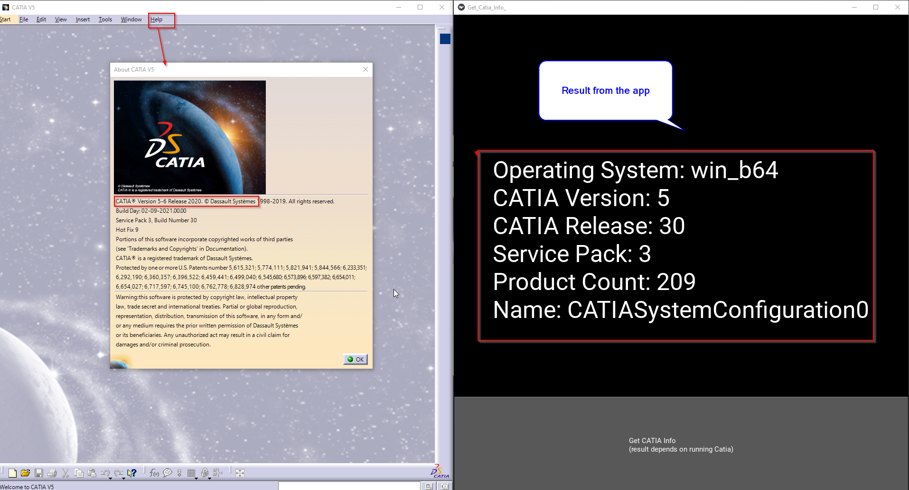
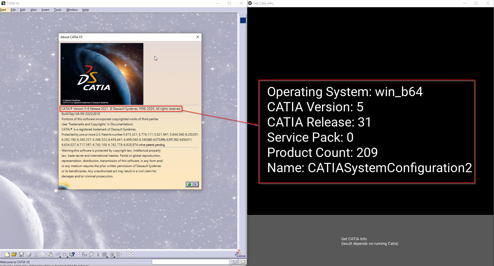
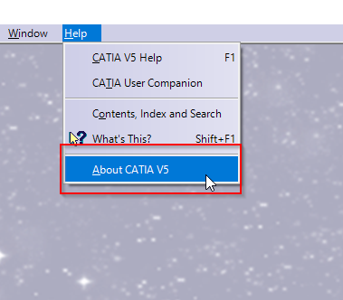

# Get_Catia_Info_App
A Kivy application that shows the Version and Release of a current running Catia V5 Application

How to use:
either run it with pyhton or use the 
dist\Get_Catia_Info_App.exe

this is how it looks like when you have a catia open.

another catia version started:

by the way to show the version in catia go to here:

There is also a  get_catia_info.exe this can be used in your code projects 
lets say you working on a c# project and need to get the current running Catia 
app version and release.

you can use the script i wrote  PythonExecutableRunner.cs
it runs the executable and returns its output.
